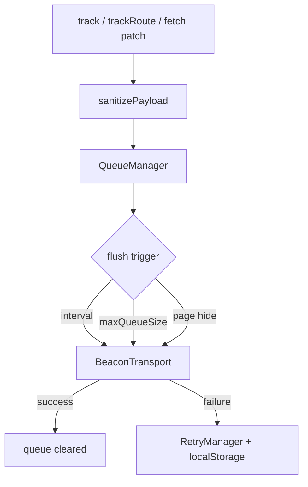

# @nuha/telemetry-sdk

Lightweight, browser-only telemetry SDK for **Next.js** applications. Tracks page routes, optional API calls, and custom events — batches them in memory and sends asynchronously with retry, without blocking the UI.

**Repository:** [github.com/aprp19/telemetry-sdk](https://github.com/aprp19/telemetry-sdk)

> **Phase 1:** Client SDK only. Gateway backend, Redpanda, ClickHouse, and consumers are not in this repo yet.

---

## Table of contents

- [Features](#features)
- [Installation](#installation)
- [Quick start](#quick-start)
- [What gets tracked](#what-gets-tracked)
- [Configuration](#configuration)
- [API reference](#api-reference)
- [Event types](#event-types)
- [Event schema](#event-schema)
- [How it works](#how-it-works)
- [Security](#security)
- [Environment variables](#environment-variables-nextjs)
- [Development](#development)
- [Releasing](#releasing)
- [License](#license)

---

## Features

| Feature | Description |
|---------|-------------|
| **Route tracking** | `route_view` events with pathname + referrer; duplicate suppression |
| **API tracking** | Optional global `fetch` patch; path + HTTP method only (no bodies) |
| **Custom events** | `telemetry.track()` with auto-enrichment and sanitization |
| **Batching** | In-memory queue; flush on interval, size, or page unload |
| **Retry** | Failed batches in `localStorage` with exponential backoff |
| **Sessions** | Stable `sessionId` via `sessionStorage` + `crypto.randomUUID()` |
| **Transport** | `sendBeacon` → `fetch` + `keepalive`; optional gzip on fetch |
| **Healthcare-safe** | Payload sanitization strips credentials and PHI-like keys |

- ESM bundle (~24 KB), zero runtime dependencies, `sideEffects: false`
- Pre-built `dist/` committed for installs from GitHub

---

## Installation

### From GitHub

```bash
npm install github:aprp19/telemetry-sdk#main:packages/telemetry-sdk
```

```bash
pnpm add github:aprp19/telemetry-sdk#main:packages/telemetry-sdk
```

```bash
yarn add github:aprp19/telemetry-sdk#main:packages/telemetry-sdk
```

**`package.json`:**

```json
{
  "dependencies": {
    "@nuha/telemetry-sdk": "github:aprp19/telemetry-sdk#main:packages/telemetry-sdk"
  }
}
```

> Use the `:packages/telemetry-sdk` suffix — the publishable package lives in that folder, not the repo root.

No build step is required in your app; the repo includes a pre-built `dist/`.

### Local development

```bash
npm install ./path/to/telemetry-sdk/packages/telemetry-sdk
```

```json
{
  "dependencies": {
    "@nuha/telemetry-sdk": "file:../telemetry-sdk/packages/telemetry-sdk"
  }
}
```

---

## Quick start

### 1. Create a client provider

```tsx
// app/providers/TelemetryProvider.tsx
"use client";

import { useEffect } from "react";
import { usePathname } from "next/navigation";
import { telemetry } from "@nuha/telemetry-sdk";

let initialized = false;

function initTelemetry(): void {
  if (initialized) return;
  initialized = true;

  telemetry.init({
    endpoint:
      process.env.NEXT_PUBLIC_TELEMETRY_ENDPOINT ??
      "https://telemetry-gateway.nuha.care",
    ppkCode: process.env.NEXT_PUBLIC_PPK_CODE ?? "1001003",
    apps: process.env.NEXT_PUBLIC_TELEMETRY_APPS ?? "SIMRS",
    apiKey: process.env.NEXT_PUBLIC_TELEMETRY_API_KEY,
    tenantId: process.env.NEXT_PUBLIC_TENANT_ID,
    hospitalId: process.env.NEXT_PUBLIC_HOSPITAL_ID,
    flushInterval: 5000,
    maxQueueSize: 20,
    trackApi: true,
    apiTrackExcludeGet: true,
  });
}

export function TelemetryProvider({
  children,
}: {
  children: React.ReactNode;
}) {
  const pathname = usePathname();

  useEffect(() => {
    initTelemetry();
  }, []);

  useEffect(() => {
    if (pathname) telemetry.trackRoute({ pathname });
  }, [pathname]);

  return <>{children}</>;
}
```

### 2. Wrap your root layout

```tsx
// app/layout.tsx
import { TelemetryProvider } from "./providers/TelemetryProvider";

export default function RootLayout({
  children,
}: {
  children: React.ReactNode;
}) {
  return (
    <html lang="en">
      <body>
        <TelemetryProvider>{children}</TelemetryProvider>
      </body>
    </html>
  );
}
```

See also: [`examples/nextjs-app-router/`](examples/nextjs-app-router/).

### 3. Track UI actions

```ts
telemetry.track({
  eventType: "button_click",
  payload: { button: "save_patient" },
});
```

`track()` only enqueues — it never blocks on the network.

### 4. Manual API tracking (axios, etc.)

When `trackApi: true` is set in `init()`:

```ts
telemetry.trackApi({ apiEndpoint: "/api/patients", method: "POST" });
```

With `trackApi: true`, `fetch` is also patched automatically.

### 5. Flush manually (optional)

```ts
await telemetry.flush();
```

The in-memory queue is cleared only after a successful send. Failures are retried from `localStorage`.

---

## What gets tracked

| Kind | `eventType` | Recorded fields | Not recorded |
|------|-------------|-----------------|--------------|
| Page route | `route_view` | `pathname`, `referrer` | Query string, hash |
| API call | `api_call` | `payload.apiEndpoint`, `payload.method` | Request/response body, query string |
| Custom | *(your value)* | `payload` (sanitized) | Blocked sensitive keys |

**`endpoint` in `init()`** is the telemetry **ingest URL** (where events are sent). It is not logged as an event field.

**`apiTrackExcludeGet: true` (default)** skips `GET` requests. Set to `false` to include them.

Requests to your configured ingest `endpoint` are never tracked (avoids feedback loops).

---

## Configuration

| Option | Required | Default | Description |
|--------|:--------:|---------|-------------|
| `endpoint` | ✓ | — | Ingestion URL (`https://…`) |
| `ppkCode` | ✓ | — | Provider / facility code |
| `apps` | ✓ | — | Application id (e.g. `SIMRS`) |
| `apiKey` | | — | `Authorization: Bearer …` |
| `flushInterval` | | `5000` | Auto-flush interval (ms) |
| `maxQueueSize` | | `20` | Flush when queue reaches this size |
| `maxRetryAttempts` | | `5` | Max retries per failed batch |
| `retryBaseDelayMs` | | `1000` | Exponential backoff base (ms) |
| `version` | | `1` | Event schema version |
| `tenantId` | | — | On every event |
| `hospitalId` | | — | On every event |
| `userId` | | — | Default user id |
| `routeDebounceMs` | | `300` | Dedupe window for `route_view` |
| `trackApi` | | `false` | Patch `fetch` for `api_call` events |
| `apiTrackExcludeGet` | | `true` | Skip `GET` API calls |
| `apiDebounceMs` | | `300` | Dedupe window for `api_call` |

```ts
telemetry.setUserId("user-42"); // after login
```

---

## API reference

| Method | Description |
|--------|-------------|
| `telemetry.init(config)` | Initialize singleton (client-only, once) |
| `telemetry.track(input)` | Enqueue custom event |
| `telemetry.trackRoute({ pathname, referrer? })` | Enqueue `route_view` |
| `telemetry.trackApi({ apiEndpoint, method? })` | Enqueue `api_call` (needs `trackApi: true`) |
| `telemetry.flush()` | `Promise<boolean>` — send queue now |
| `telemetry.setUserId(id)` | Default `userId` for later events |
| `telemetry.getSessionId()` | Current session id |
| `telemetry.getPendingEventCount()` | In-memory queue size |
| `telemetry.isInitialized()` | `init()` was called |
| `telemetry.destroy()` | Stop timers, uninstall fetch patch |

**Advanced exports:** `TelemetrySDK`, `QueueManager`, `SessionManager`, `RetryManager`, `RouteTracker`, `ApiTracker`, `BeaconTransport`, `sanitizePayload`, types.

---

## Event types

### `route_view`

```json
{
  "eventType": "route_view",
  "pathname": "/emr/patient/123",
  "referrer": "https://app.example/emr"
}
```

### `api_call`

```json
{
  "eventType": "api_call",
  "payload": {
    "apiEndpoint": "/api/patients",
    "method": "POST"
  }
}
```

### Custom (example)

```json
{
  "eventType": "button_click",
  "payload": { "button": "save_patient" }
}
```

---

## Event schema

```ts
type TelemetryEvent = {
  id: string;
  version: number;
  ppkCode: string;
  apps: string;
  sessionId: string;
  userId?: string;
  eventType: string;
  pathname?: string;
  referrer?: string;
  tenantId?: string;
  hospitalId?: string;
  payload?: Record<string, unknown>;
  timestamp: string; // ISO 8601
};
```

**HTTP POST body:**

```json
{
  "events": [ /* TelemetryEvent[] */ ]
}
```

**Auto-enrichment** on every event: `id`, `timestamp`, `sessionId`, `ppkCode`, `apps`, `version`, `tenantId`, `hospitalId`, and `userId` (when set).

---

## How it works



| Component | Role |
|-----------|------|
| **SessionManager** | `sessionId` in `sessionStorage` (`nuha_telemetry_session_id`) |
| **QueueManager** | In-memory batching and flush triggers |
| **RetryManager** | `localStorage` key `nuha_telemetry_failed_batches` |
| **RouteTracker** | Dedupes same `pathname` within `routeDebounceMs` |
| **ApiTracker** | Patches `fetch`; dedupes method + path; skips ingest URL |
| **BeaconTransport** | `sendBeacon` (JSON) → `fetch` + `keepalive` (+ gzip when supported) |

---

## Security

Payloads are **sanitized** before enqueue. Blocked key patterns include passwords, tokens, cookies, API keys, and common PHI field names. JWT-like values are redacted.

**Do not send:**

- Passwords, secrets, or auth tokens  
- Cookies or session material  
- Patient medical data or PHI in `payload`  

Use opaque ids (e.g. internal `userId`) instead of clinical content.

---

## Environment variables (Next.js)

```env
NEXT_PUBLIC_TELEMETRY_ENDPOINT=https://telemetry-gateway.nuha.care
NEXT_PUBLIC_PPK_CODE=1001003
NEXT_PUBLIC_TELEMETRY_APPS=SIMRS
NEXT_PUBLIC_TELEMETRY_API_KEY=your-api-key
NEXT_PUBLIC_TENANT_ID=tenant-1
NEXT_PUBLIC_HOSPITAL_ID=hospital-1
```

---

## Development

From the **repository root**:

```bash
npm install
npm run build       # builds packages/telemetry-sdk/dist
npm run typecheck
```

From **`packages/telemetry-sdk`**:

```bash
npm run dev         # tsup watch
npm run build
npm run typecheck
```

### Project structure

```
telemetry-sdk/
├── package.json                 # workspace root
├── packages/telemetry-sdk/
│   ├── src/
│   │   ├── core/                # TelemetrySDK, validation
│   │   ├── queue/               # QueueManager, RetryManager
│   │   ├── transport/           # BeaconTransport
│   │   ├── trackers/            # RouteTracker, ApiTracker
│   │   ├── storage/             # SessionManager, sanitize
│   │   └── types/
│   └── dist/                    # published bundle
└── examples/nextjs-app-router/
```

---

## Releasing

After code changes, rebuild and commit `dist/` so GitHub installs stay up to date:

```bash
npm run build
git add packages/telemetry-sdk/dist
git commit -m "chore: rebuild dist"
git push origin main
```

---

## License

MIT — see [LICENSE](LICENSE) if present, or package metadata.
